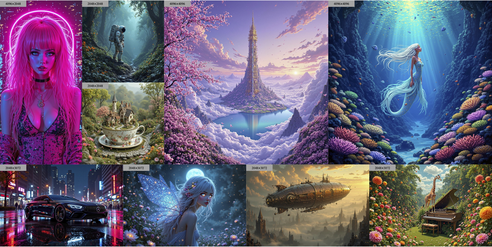
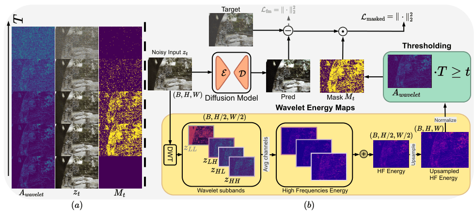

<div align="center">

# Latent Wavelet Diffusion For Ultra High-Resolution Image Synthesis

[](https://openreview.net/forum?id=5og80LMVxG)
[](https://arxiv.org/abs/2506.00433)
[](https://luigisigillo.github.io/LWD-page)
[](LICENSE)
[](https://www.python.org/downloads/)
[](https://pytorch.org/)

**[Luigi Sigillo](https://luigisigillo.github.io/)** · [Shengfeng He](https://shengfenghe.github.io/) · [Danilo Comminiello](https://danilocomminiello.site.uniroma1.it/)

**ICLR 2026** | International Conference on Learning Representations

</div>

---

<p align="center">
  
</p>

## 🔥 Highlights

- **🎯 Model-Agnostic Framework**: Apply to any diffusion architecture (SD3, DiT, FLUX)
- **🌊 Wavelet-Based Training**: Frequency-aware loss masking for superior high-frequency detail
- **📈 State-of-the-Art Quality**: Improved FID, LPIPS, and perceptual metrics at 2K/4K resolution
- **⚡ Efficient Training**: Leverages pre-cached latents and adaptive masking
- **🔧 Easy Integration**: Drop-in components for existing diffusion training pipelines

---

## 📝 Abstract

**Latent Wavelet Diffusion (LWD)** is a lightweight, model-agnostic training framework that significantly improves detail and texture fidelity in ultra-high-resolution (2K–4K) image synthesis — **without architectural modifications and with zero additional inference cost**. LWD introduces a frequency-aware masking strategy derived from wavelet energy maps that dynamically focuses training on detail-rich regions of the latent space, complemented by a scale-consistent VAE objective for high spectral fidelity. Our approach consists of three components applied in sequence:

1. **VAE Spectral Enhancement** - Fine-tunes the VAE with a multi-scale scale-consistency loss (L2 reconstruction + KL regularization + LPIPS + scale-consistency), producing a regularized latent space where high-frequency energy corresponds to meaningful structure rather than noise
2. **Wavelet-Derived Saliency Maps** - Applies a single-level DWT to the latent representation and aggregates the energy of the high-frequency subbands (LH, HL, HH) into a spatial saliency map that highlights structurally rich regions
3. **Frequency-Guided Loss Masking** - Applies a time-dependent binary mask so that high-frequency regions receive supervision across *more* diffusion timesteps, while smooth regions are updated less frequently — concentrating learning capacity where detail matters most


---

## 📑 Table of Contents

- [🔥 Highlights](#-highlights)
- [📝 Abstract](#-abstract)
<!-- - [⚡ Quick Start](#-quick-start) -->
<!-- - [📂 Project Structure](#-project-structure) -->
- [🛠️ Installation](#️-installation)
- [🚀 Pipeline Overview](#-pipeline-overview)
- [🧬 Method Details](#-method-details)
- [🔄 Applying to Other Models](#-applying-to-other-diffusion-models)
- [💻 Hardware Requirements](#-hardware-requirements)
- [📊 Results](#-results)
- [📖 Citation](#-citation)
- [🙏 Acknowledgements](#-acknowledgements)
- [📄 License](#-license)


## 🛠️ Installation

### Prerequisites

- Python 3.10+
- CUDA-compatible GPU (24GB+ VRAM recommended for 2K, 48GB+ for 4K)
- PyTorch 2.1.0+
- CUDA 11.8 or higher

### Setup

```bash
# Clone the repository
git clone https://github.com/LuigiSigillo/LatentWaveletDiffusion.git
cd LatentWaveletDiffusion

# Create conda environment
conda create -n lwd python=3.12
conda activate lwd

# Install dependencies
pip install -r requirements.txt

# Install PyTorch Wavelets
pip install -e src/pytorch_wavelets/
```

---

## 🚀 Pipeline Overview

The complete pipeline consists of 5 stages:

```
┌─────────────────┐    ┌─────────────────┐    ┌─────────────────┐     ┌─────────────────┐    ┌────────────────┐
│  1. VAE         │    │  2. Cache       │    │  3. Train       │     │  4. Evaluation  │    │  5. Inference  │
│  Fine-tuning    │───▶│  Latents &      │───▶│  with Wavelet  │───▶│                 │───▶│                │
│  (Optional)     │    │  Embeddings     │    │  Masking        │     │                 │    │                │
└─────────────────┘    └─────────────────┘    └─────────────────┘     └─────────────────┘    └────────────────┘ 

```

<details>
<summary><b>Step 1: VAE Fine-tuning (Optional)</b></summary>

Fine-tune the VAE with a multi-resolution scale-consistency objective (L2 reconstruction + KL regularization + LPIPS perceptual loss + scale-consistency term). This is the **first and prerequisite stage** of LWD: without it, the DWT-based wavelet saliency maps would pick up compression artifacts rather than meaningful structure. The fine-tuned VAE regularizes the latent spectrum so that high-frequency energy reliably corresponds to textures and edges.

```bash
cd src/vae_SE_finetuning

python vae_finetune_diffusability.py \
    --pretrained_model_name_or_path="black-forest-labs/FLUX.1-dev" \
    --subfolder="vae" \
    --data_dir="/path/to/training/images" \
    --output_dir="./ckpt/vae_SE" \
    --image_size=512 \
    --batch_size=8 \
    --learning_rate=1e-5 \
    --max_train_steps=60000 \
    --mixed_precision="bf16" \
    --lpips_weight=0.05 \
    --regularization_alpha=0.1 \
    --with_tracking \
    --checkpointing_steps=5000
```

**Key arguments:**
| Argument | Description |
|----------|-------------|
| `--lpips_weight` | Weight for LPIPS perceptual loss (default: 0.05) |
| `--regularization_alpha` | Multi-scale consistency loss weight (default: 0.1) |
| `--freeze_encoder` | Optionally freeze encoder, train only decoder |

</details>

### Step 2: Cache Latents & Embeddings

Pre-compute VAE latents and text embeddings to avoid OOM during training.

#### 2a. Cache Text Embeddings (T5 + CLIP)

```bash
# Edit src/batch_scripts/cache_prompt_embeds.sh:
export NUM_WORKERS=2
export DATA_DIR="/path/to/your/dataset"
export MODEL_NAME="black-forest-labs/FLUX.1-dev"

# Run caching
bash src/batch_scripts/cache_prompt_embeds.sh
```

#### 2b. Cache VAE Latents

```bash
# Edit src/batch_scripts/cache_latent_codes.sh:
export NUM_WORKERS=4
export DATA_DIR="/path/to/your/dataset"
export OUTPUT_DIR="/path/to/latents"
export MODEL_NAME="black-forest-labs/FLUX.1-dev"  # or your fine-tuned VAE
export RESOLUTION=2048  # target resolution

# Run caching
bash src/batch_scripts/cache_latent_codes.sh
```

**Data Format:**

Your dataset should be organized as:
```
dataset/
├── image_0.jpg
├── image_0.json          # {"prompt": "...", "generated_prompt": "..."}
├── image_1.jpg
├── image_1.json
└── ...
```

After caching:
```
dataset/
├── image_0.jpg
├── image_0.json
├── image_0_latent_code.safetensors      # VAE latents
├── image_0_prompt_embed.safetensors     # T5+CLIP embeddings
├── image_0_generated_prompt_embed.safetensors
└── ...
```

### Step 3: Training with Wavelet

Train the diffusion model with our wavelet-based frequency-adaptive loss.
<p align="center">
  
</p>

```bash
# Edit src/batch_scripts/train_2k.sh:
export MODEL_NAME="black-forest-labs/FLUX.1-dev"
export DATA_DIR="/path/to/dataset"
export LATENT_CODE_DIR="/path/to/cached/latents"
export OUTPUT_DIR="/path/to/checkpoints"

# Run training
bash src/batch_scripts/train_2k.sh
```

**Key training arguments:**

| Argument | Description | Default |
|----------|-------------|---------|
| `--wavelet_attention` | **Enable wavelet-based loss masking** | `True` |
| `--latent_code_dir` | Directory with cached latents | None |
| `--train_batch_size` | Batch size per GPU | 1 |
| `--max_train_steps` | Total training iterations | 2000 |
| `--gradient_checkpointing` | Enable to save VRAM | `False` |
| `--real_prompt_ratio` | Ratio of original vs VLM prompts | 0.2 |
<!-- | `--pretrained_vae_path` | Path to fine-tuned VAE | None | -->


<!-- **Example SLURM script (for HPC clusters):**

```bash
#!/bin/bash
#SBATCH --nodes=1
#SBATCH --gres=gpu:4
#SBATCH --time=24:00:00

accelerate launch --num_processes 4 --multi_gpu --mixed_precision bf16 \
    src/train_2k.py \
    --pretrained_model_name_or_path="black-forest-labs/FLUX.1-dev" \
    --dataset_root=$DATA_DIR \
    --output_dir=$OUTPUT_DIR \
    --wavelet_attention \
    --train_batch_size=1 \
    --max_train_steps=2000 \
    --gradient_checkpointing
``` -->

### Step 4: Evaluation

We provide evaluation scripts for both 2K and 4K resolutions using multiple benchmarks.

| Metric | Type | Description |
|--------|------|-------------|
| **FID** | Full-reference | Fréchet Inception Distance |
| **LPIPS** | Full-reference | Learned Perceptual Image Patch Similarity |
| **MAN-IQA** | No-reference | Multi-scale Attention Network IQA |
| **QualiCLIP** | No-reference | CLIP-based quality assessment |
| **HPSv2** | Text-image | Human Preference Score v2 |
| **PickScore** | Text-image | Preference learning score |

#### 4a. Evaluate 2K Models (`eval_v2.py`)

For 2K resolution models, we support HPDv2 and DPG benchmarks.

```bash
# Generate images for HPDv2 test set
python src/eval_v2.py \
    --generate_hpdv2_testset \
    --json_file="/path/to/HPDv2/test.json" \
    --output_dir="/path/to/output" \
    --checkpoint_path="/path/to/checkpoint-2000" \
    --cache_dir=$HF_HOME \
    --height=2048 \
    --width=2048 \
    --seed=42

# Generate images for DPG benchmark
python src/eval_v2.py \
    --generate_dpg_testset \
    --prompt_folder_dpg="/path/to/dpg_bench/prompts" \
    --output_dir="/path/to/output" \
    --checkpoint_path="/path/to/checkpoint-2000" \
    --cache_dir=$HF_HOME

# Calculate metrics on generated images
python src/eval_v2.py \
    --calculate_metrics \
    --generated_folder="/path/to/generated/images" \
    --reference_folder="/path/to/reference/images" \
    --cache_dir=$HF_HOME
```

**Key arguments for `eval_v2.py`:**

| Argument | Description |
|----------|-------------|
| `--generate_hpdv2_testset` | Generate images for HPDv2 benchmark |
| `--generate_dpg_testset` | Generate images for DPG benchmark |
| `--calculate_metrics` | Compute FID, PickScore, QualiCLIP, MAN-IQA, HPSv2 |
| `--json_file` | Path to HPDv2 test JSON file |
| `--prompt_folder_dpg` | Path to DPG benchmark prompts folder |
| `--checkpoint_path` | Path to trained checkpoint |
| `--height`, `--width` | Resolution (default: 2048×2048) |

#### 4b. Evaluate 4K Models (`eval_4k.py`)

For 4K resolution models, we use the HPSv2 benchmark with parallel multi-GPU generation.

```bash
# Generate and evaluate 4K images (uses all available GPUs)
python src/eval_4k.py \
    --checkpoint_path="/path/to/4k/checkpoint/adapter_weights.safetensors" \
    --generate \
    --height=4096 \
    --width=4096 \
    --seed=8888 \
    --cache_dir=$HF_HOME

# Generate for a specific style only
python src/eval_4k.py \
    --checkpoint_path="/path/to/4k/checkpoint/adapter_weights.safetensors" \
    --generate \
    --style="anime" \
    --height=4096 \
    --width=4096 \
    --cache_dir=$HF_HOME
```

**Key arguments for `eval_4k.py`:**

| Argument | Description |
|----------|-------------|
| `--checkpoint_path` | Path to 4K adapter weights (`.safetensors`) |
| `--generate` | Enable image generation |
| `--style` | Generate for specific style only (anime, concept-art, paintings, photo) |
| `--height`, `--width` | Resolution (default: 4096×4096) |
| `--cache_dir` | HuggingFace cache directory |

**Supported styles:** `anime`, `concept-art`, `paintings`, `photo`


### Step 5: Inference

For running inference, please use the Jupyter notebooks provided in the [`src/inference_nb/`](src/inference_nb/) folder. The notebook contains step-by-step instructions for generating images using the trained model.


## 🧬 Method Details

### Wavelet Attention Mechanism

We use Discrete Wavelet Transform (DWT) to identify high-frequency regions in the latent space:

```python
from pytorch_wavelets import DWTForward
from src.new_wav_attn_maps import compute_wavelet_attention

# Initialize DWT
dwt = DWTForward(J=1, wave="haar")

# Compute attention map from latents
# Returns attention values in [0, 1] where higher = more high-frequency content
attention_map = compute_wavelet_attention(latent_tensor, dwt)  # (B, H, W)
```

**How it works:**
1. Apply 2D DWT to decompose latent into LL (low-freq) and LH, HL, HH (high-freq) subbands
2. Compute energy (squared magnitude) of high-frequency subbands
3. Normalize to create attention map indicating regions with rich detail

### Wavelet-Based Loss Masking

During training, we apply time-dependent masking to focus on high-frequency regions:

```python
from src.new_wav_attn_maps import get_mask_batch

# Get binary mask based on timestep and attention map
# M_t(i,j) = 1 if T * (A[i,j] + l) >= t, else 0
# High-frequency regions (high A) remain supervised across MORE timesteps.
# All regions receive at least l*T steps of supervision (lower bound guarantee).
mask = get_mask_batch(
    A=attention_map,    # Wavelet saliency map
    l=0.3,              # Lower bound (all regions trained at least 30% of steps)
    T=1000,             # Total timesteps
    timesteps=t         # Current timestep
)

# Apply masked loss
masked_diff = mask * (predicted - target)
loss = (weighting * masked_diff.pow(2)).mean()
```

**Intuition:** Regions with high wavelet energy (textures, edges) receive supervision across more diffusion timesteps, concentrating learning where structural detail matters most. The lower bound `l` ensures no region is ever completely ignored.

---

## 🔄 Applying to Other Diffusion Models

Our method is designed to be **model-agnostic** and can be integrated into any diffusion training pipeline. This repository demonstrates the technique using **URAE** as a baseline for high-resolution adaptation with FLUX, but the same wavelet-based frequency masking can be applied to SDXL, DiT, Sana, or any other diffusion architecture.

### 📋 Step-by-Step Integration Guide

#### **Step 1: Copy Required Files to Your Project**

Copy these two essential files to your training repository:

```bash
# Copy the wavelet attention implementation
cp src/new_wav_attn_maps.py /path/to/your/project/

#install pytorch-wavelet as a package
cd src/
git clone https://github.com/fbcotter/pytorch_wavelets
pip install PyWavelets>=1.0.0
pip install -e src/pytorch_wavelets/
```

**Required files:**
- `new_wav_attn_maps.py` - Contains `compute_wavelet_attention()` and `get_mask_batch()` functions
- `pytorch_wavelets/` - PyTorch DWT implementation

#### **Step 2: Add Command-Line Argument**

Add a flag to enable/disable wavelet attention in your training script:

```python
parser.add_argument(
    "--wavelet_attention",
    action="store_true",
    help="Enable wavelet-based frequency-adaptive loss masking"
)
parser.add_argument(
    "--wav_att_l_mask",
    type=float,
    default=0.3,
    help="Lower bound for wavelet attention mask. Controls the minimum fraction of "
         "training steps for each region. Higher values (e.g., 0.2) = more conservative, "
         "lower values (e.g., 0.05) = more aggressive high-frequency focus. (default: 0.3)"
)
```

#### **Step 3: Initialize DWT Before Training Loop**

Add this initialization **before your training loop starts**:

```python
# Add after model initialization, before training loop
if args.wavelet_attention:
    print("✓ Wavelet attention enabled")
    from new_wav_attn_maps import compute_wavelet_attention, get_mask_batch
    from pytorch_wavelets import DWTForward
    
    # Initialize Discrete Wavelet Transform
    dwt = DWTForward(J=1, wave="haar").to(accelerator.device)
```

**Location in our code:** See [train_2k.py:L779-L783](src/train_2k.py#L779-L783)

#### **Step 4: Modify Loss Computation in Training Loop**

Locate the loss computation in your training loop and modify it as follows:

**Before (Standard Loss):**
```python
# Original loss computation
loss = F.mse_loss(model_pred, target)
# or
loss = ((model_pred - target) ** 2).mean()
```

**After (With Wavelet Attention):**
```python
# Compute loss with wavelet-based masking
if not args.wavelet_attention:
    # Standard loss (unchanged)
    loss = (weighting * (model_pred - target) ** 2).mean()
else:
    # Wavelet-based frequency-adaptive loss
    # 1. Compute wavelet attention map from noisy latents
    A, _ = compute_wavelet_attention(noisy_latents, dwt)  # shape: (B, H, W)
    
    # 2. Generate time-dependent binary mask
    M, _ = get_mask_batch(
        A, 
        l=args.wav_att_l_mask,              # Lower bound (e.g., 0.1)
        T=scheduler.num_train_timesteps,     # Total timesteps (e.g., 1000)
        timesteps=timesteps                  # Current timesteps (B,)
    )  # shape: (B, 1, H, W)
    
    # 3. Apply mask to loss
    masked_diff = M * (model_pred - target)  # Element-wise masking
    loss = (weighting * masked_diff.pow(2)).mean()
```

**Location in our code:** See [train_2k.py:L890-L901](src/train_2k.py#L890-L901)

### 🔍 Understanding the Key Modifications

#### **What `compute_wavelet_attention()` does:**
1. Applies 2D DWT to decompose latents into frequency subbands (LL, LH, HL, HH)
2. Computes energy of high-frequency subbands (LH, HL, HH)
3. Returns normalized attention map (B, H, W) where higher values = more high-frequency content

#### **What `get_mask_batch()` does:**
1. Takes attention map `A` and current timesteps `t`
2. Computes threshold: `T * (A + l)` for each spatial location
3. Creates binary mask: `M = 1` where `threshold >= t`, else `M = 0`
4. **Effect:** Early in denoising (high t), only low-frequency regions are refined. Late in denoising (low t), high-frequency regions are refined.
5. **Parameter `l` (tunable):** Controls minimum training steps per region. Typical range: 0.05-0.2

### 🎛️ Tuning the `l` Parameter

The `--wav_att_l_mask` parameter is **crucial** for controlling the training behavior:

| `l` value | Behavior | Use Case |
|-----------|----------|----------|
| **0.1** | Aggressive high-frequency focus | High-detail datasets (textures, fine art) |
| **0.3** ✓ | **Balanced (recommended, used in paper)** | General purpose, most datasets |
| **0.5** | Conservative refinement | Natural images, portraits |
| **0.7** | Very gradual masking — approaches uniform training | Simple images, coarse details |

> **Note:** `l=0.3` is the value used in all paper experiments. The ablation study showed it yields the best FID, GLCM, and CLIPScore across the `{0.0, 0.1, 0.3, 0.5, 0.7}` sweep.

**Formula:** Each spatial location with saliency value `A[i,j]` gets refined for `T * (A[i,j] + l)` timesteps.
- Higher `l` → All regions trained more uniformly
- Lower `l` → Sharper distinction between high/low frequency regions

### 📝 Integration Examples for Different Architectures

<details>
<summary><b>FLUX.1 (Flow Matching) - This Repository</b></summary>

```python
# In your FLUX training loop (as demonstrated in this repo with URAE)
if args.wavelet_attention:
    from new_wav_attn_maps import compute_wavelet_attention, get_mask_batch
    from pytorch_wavelets import DWTForward
    dwt = DWTForward(J=1, wave="haar").to(device)

# Training loop
for batch in dataloader:
    # ... [standard FLUX training code] ...
    
    # Flow matching target
    target = noise - model_input
    
    if args.wavelet_attention:
        # Compute wavelet attention from noisy latents
        A, _ = compute_wavelet_attention(noisy_model_input, dwt)
        
        # Generate adaptive mask with tunable l parameter
        M, _ = get_mask_batch(
            A, 
            l=args.wav_att_l_mask,              # PARAMETRIC: tune between 0.05-0.2
            T=scheduler.num_train_timesteps,     # e.g., 1000
            timesteps=timesteps
        )
        
        # Flow matching loss with mask
        masked_diff = M * (model_pred - target)
        loss = (weighting * masked_diff.pow(2)).mean()
    else:
        loss = (weighting * (model_pred - target) ** 2).mean()
```

**Reference:** [train_2k.py:L890-L901](src/train_2k.py#L890-L901)

</details>

<details>
<summary><b>Sana/PixArt-Sigma (DiT)</b></summary>

```python
# In your Sana training script setup
def initialize_wavelet_attention(args, device):
    """Initialize wavelet attention components if enabled."""
    if args.wavelet_attention:
        print("Wavelet attention is enabled")
        from pytorch_wavelets import DWTForward
        dwt = DWTForward(J=1, wave="haar").to(device)
        return dwt
    return None

# Before training loop
dwt = initialize_wavelet_attention(args, accelerator.device)

# Training loop
for batch in dataloader:
    # ... [standard Sana training code] ...

    with accelerator.accumulate(model):
        optimizer.zero_grad()

        # Pass dwt through model_kwargs to the diffusion loss function
        loss_term = train_diffusion.training_losses(
            model,
            clean_images,
            timesteps,
            model_kwargs=dict(
                y=y,
                mask=y_mask,
                data_info=data_info,
                dwt=dwt  # Pass dwt object
            )
        )
        loss = loss_term["loss"].mean()
        accelerator.backward(loss)

# In gaussian_diffusion.py (diffusion model class)
def training_losses(self, model, x_start, t, model_kwargs=None, noise=None):
    # ... [standard diffusion code] ...

    terms = {}
    if model_kwargs.get("dwt", None) is not None:
        from .new_wav_attn_maps import compute_wavelet_attention, get_mask_batch

        # Compute wavelet attention from noisy input
        A = compute_wavelet_attention(x_t, model_kwargs.get("dwt"))  # shape: (B, H, W)
        M = get_mask_batch(A, l=0.3, T=self.num_timesteps, timesteps=t)

    # ... [model prediction code] ...

    # Compute loss with wavelet mask
    if model_kwargs.get("dwt", None) is not None:
        masked_diff = M * (output - target)  # shape (B, C, H, W)
        terms["mse"] = mean_flat(masked_diff.pow(2))
    else:
        terms["mse"] = mean_flat(loss)
```

</details>

<details>
<summary><b>Stable Diffusion 3 (Diffusion4K)</b></summary>

```python
# In your SD3 training loop
if args.wavelet_attention:
    from new_wav_attn_maps import compute_wavelet_attention, get_mask_batch
    from pytorch_wavelets import DWTForward
    dwt = DWTForward(J=1, wave="haar").to(device)

# Training loop
for batch in dataloader:
    # ... [standard SD3 training code] ...

    # Flow matching target (SD3 uses flow matching like FLUX)
    target = model_input

    if args.wavelet_attention:
        # Compute wavelet attention from noisy latents
        A = compute_wavelet_attention(noisy_model_input, dwt)  # shape: (B, H, W)

        # Generate adaptive mask with tunable l parameter
        M = get_mask_batch(
            A,
            l=args.wav_att_l_mask,              # PARAMETRIC: tune between 0.05-0.2
            T=noise_scheduler.config.num_train_timesteps,  # e.g., 1000
            timesteps=timesteps
        )

        # Flow matching loss with mask
        masked_diff = M * (model_pred - target)
        loss = (weighting.float() * masked_diff.pow(2)).mean()
    else:
        loss = torch.mean(
            (weighting.float() * (model_pred.float() - target.float()) ** 2).reshape(target.shape[0], -1),
            1,
        )
        loss = loss.mean()
```

</details>


### ✅ Checklist for Integration

- [ ] Copy `new_wav_attn_maps.py` to your project
- [ ] Install or copy `pytorch_wavelets/`
- [ ] Add `--wavelet_attention` and `--wav_att_l_mask` arguments to training script
- [ ] Initialize `DWTForward` before training loop (with `if args.wavelet_attention:`)
- [ ] Locate loss computation in training loop
- [ ] Add conditional wavelet attention loss computation
- [ ] Test with `--wavelet_attention` flag enabled
- [ ] **Tune `--wav_att_l_mask` parameter** 
- [ ] Monitor training: check if high-frequency details improve


## 📊 Results

LWD is evaluated on two ultra-resolution benchmarks:
- **Aesthetic-4K** — A curated 4K benchmark with GPT-4o-generated captions and high visual quality.
- **LAION-High-Res** — A filtered subset of LAION-5B with 50K × 2K and 20K × 4K image-caption pairs.

<p align="center">
  
  <br>
  <em>Comparison of high-frequency detail preservation. Our method generates sharper textures and finer details.</em>
</p>

---

## 📖 Citation

If you find this work useful, please cite our ICLR 2026 paper:

```bibtex
@inproceedings{
sigillo2026latent,
title={Latent Wavelet Diffusion For Ultra High-Resolution Image Synthesis},
author={Luigi Sigillo and Shengfeng He and Danilo Comminiello},
booktitle={The Fourteenth International Conference on Learning Representations},
year={2026},
url={https://openreview.net/forum?id=5og80LMVxG}
}
```

This work builds upon URAE as a baseline for demonstrating model-agnostic wavelet-based training. Please also consider citing:

```bibtex
@article{yu2025urae,
  title={Ultra-Resolution Adaptation with Ease},
  author={Yu, Ruonan and Liu, Songhua and Tan, Zhenxiong and Wang, Xinchao},
  journal={arXiv preprint arXiv:2503.16322},
  year={2025}
}
```

---

## 🙏 Acknowledgements

We thank the authors and contributors of the following projects:

- **[URAE](https://github.com/Huage001/URAE)** - For the high-resolution adaptation baseline that we build upon
- **[FLUX](https://blackforestlabs.ai/)** - For the state-of-the-art diffusion model architecture
- **[pytorch_wavelets](https://github.com/fbcotter/pytorch_wavelets)** - For efficient DWT implementation
- **[Hugging Face Diffusers](https://github.com/huggingface/diffusers)** - For the excellent training infrastructure
- **[patch_conv](https://github.com/mit-han-lab/patch_conv)** - For memory-efficient VAE operations

Special thanks to the ICLR 2026 reviewers for their valuable feedback.

---

## 🌟 Star History

<a href="https://star-history.com/#LuigiSigillo/LatentWaveletDiffusion&Date">
  <picture>
    <source media="(prefers-color-scheme: dark)" srcset="https://api.star-history.com/svg?repos=LuigiSigillo/LatentWaveletDiffusion&type=Date&theme=dark" />
    <source media="(prefers-color-scheme: light)" srcset="https://api.star-history.com/svg?repos=LuigiSigillo/LatentWaveletDiffusion&type=Date" />
    
  </picture>
</a>

---

## 📄 License

This project is licensed under the Apache License 2.0 - see the [LICENSE](LICENSE) file for details.